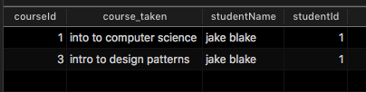
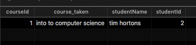
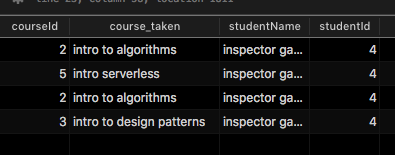

## 1. create the tables that allow any person to take any course, but only allow them to sign up for any given course once.

```
CREATE TABLE people (id INT NOT NULL AUTO_INCREMENT, fname VARCHAR(50), PRIMARY KEY(ID));

CREATE TABLE courses (id INT NOT NULL AUTO_INCREMENT, title VARCHAR(50), PRIMARY KEY(ID));

CREATE TABLE course_people (id INT NOT NULL AUTO_INCREMENT, course_id INT NOT NULL, person_id INT NOT NULL, PRIMARY KEY(ID), FOREIGN KEY (person_id) REFERENCES people(id), FOREIGN KEY (course_id) REFERENCES courses(id));
```

## 2. show all courses taken by a given person.

```
select courses.id as courseId, courses.title as course_taken, people.fname as studentName, people.id as studentId from course_people left join people on people.id = course_people.person_id left join courses on courses.id = course_people.course_id where person_id = 1;
```







## 3. show all people and the number of courses they are taking.
```
select people.fname, count(course_people.course_id) as numCourses from people left join course_people on people.id = course_people.person_id GROUP by people.fname;
```

